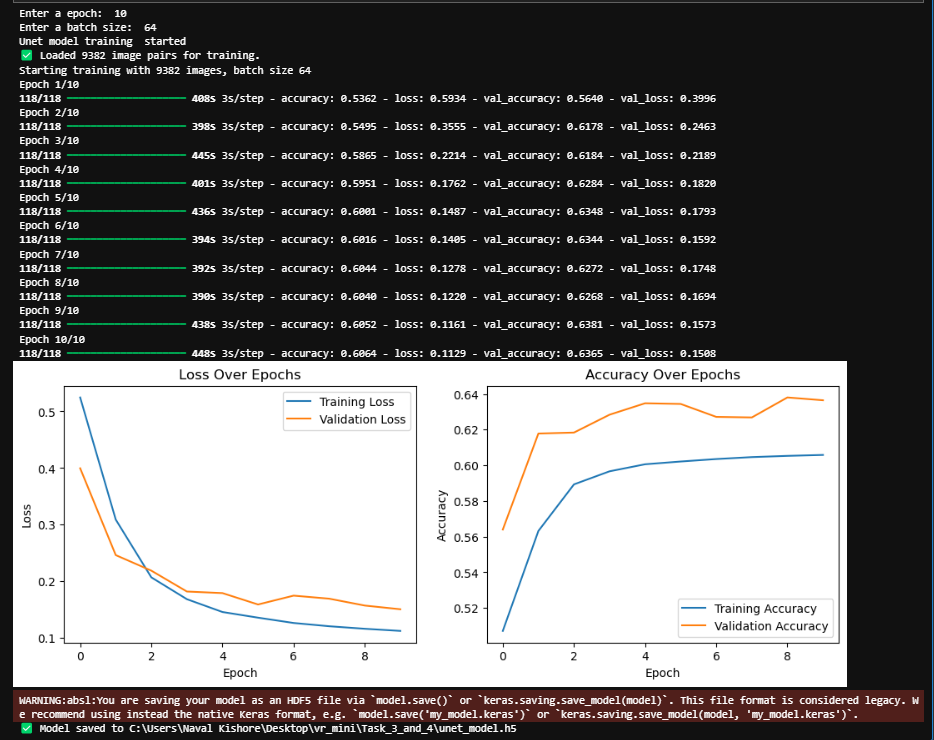
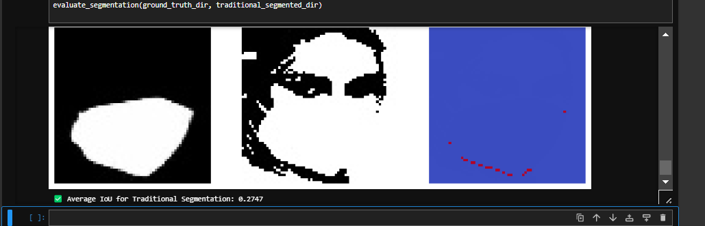
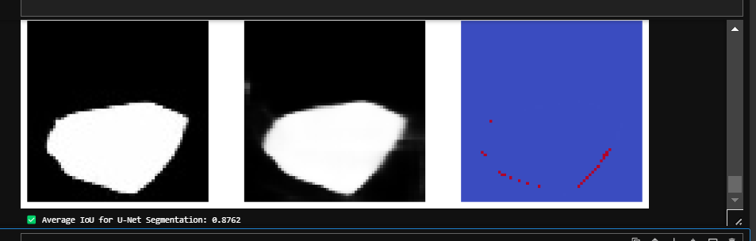
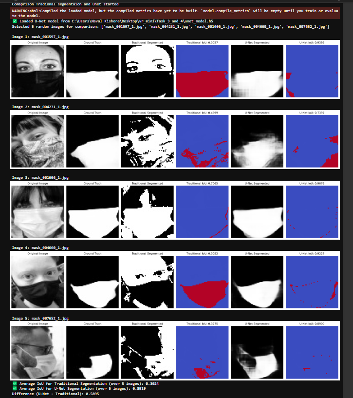

# Project: Face Mask Detection, Classification, and Segmentation 

## Project submitted by 
-- Abhishek Kumar Singh (MT2024006)
-- Naval Kishore Singh Bisht (MT2024099)

---
# for classification 

This part of project aims to classify images of faces as "with mask" or "without mask" using various machine learning and deep learning techniques.

## Project Structure

```
classification_3.ipynb
dataset/
    with_mask/
        ...
    without_mask/
        ...
```

## Requirements

- Python 3.9
- NumPy
- OpenCV
- scikit-learn
- scikit-image
- TensorFlow
- tabulate

## Installation

1. Clone the repository:
    ```sh
    git clone https://github.com/aks-master/-VR_Project1_Abhishek_MT2024006.git
    ```

2. Create a new Anaconda environment and install the required packages:
    ```sh
    conda create --name mask_detection_env python=3.9
    conda activate mask_detection_env
    pip install -r requirements.txt
    ```

## Dataset

The dataset consists of images categorized into two folders: `with_mask` and `without_mask`. Each folder contains images of faces with and without masks, respectively. The dataset was obtained from [https://github.com/chandrikadeb7/Face-Mask-Detection/tree/master/dataset](https://github.com/chandrikadeb7/Face-Mask-Detection/tree/master/dataset)


## Methodology

### Part A: Binary Classification Using Handcrafted Features and ML Classifiers

1. **Feature Extraction**:
    - Extract handcrafted features (HOG) from the dataset.
    - Function: `extract_features(image_path, use_hog)`

2. **Train and Evaluate Classifiers**:
    - Train and evaluate SVM and Neural Network classifiers.
    - Report and compare the accuracy of the classifiers.

### Part B: Binary Classification Using CNN

1. **Data Preparation**:
    - Load the dataset and preprocess images for CNN.
    - One-hot encode labels for categorical cross-entropy loss.

2. **CNN Model 1**:
    - Uses Adam optimizer, deeper layers, and higher dropout.
    - Function: `create_cnn_model_1()`

3. **CNN Model 2**:
    - Uses SGD optimizer, batch normalization, and fewer layers.
    - Function: `create_cnn_model_2()`

4. **Model Training and Evaluation**:
    - Train both CNN models and evaluate their performance.
    - Compare the accuracy of the models.

## Hyperparameters and Experiments

###

### SVM 
- sklearn SVC() was used with following hyper parameters (svm_clf.get_params())
```python
{'C': 1.0,
 'break_ties': False,
 'cache_size': 200,
 'class_weight': None,
 'coef0': 0.0,
 'decision_function_shape': 'ovr',
 'degree': 3,
 'gamma': 'scale',
 'kernel': 'rbf',
 'max_iter': -1,
 'probability': False,
 'random_state': None,
 'shrinking': True,
 'tol': 0.001,
 'verbose': False}
```

### MLP neural network
- sklearn MLPClassifier() was used with following hyper parameters
```python
{'activation': 'relu',
 'alpha': 0.0001,
 'batch_size': 'auto',
 'beta_1': 0.9,
 'beta_2': 0.999,
 'early_stopping': False,
 'epsilon': 1e-08,
 'hidden_layer_sizes': (100,),
 'learning_rate': 'constant',
 'learning_rate_init': 0.001,
 'max_fun': 15000,
 'max_iter': 200,
 'momentum': 0.9,
 'n_iter_no_change': 10,
 'nesterovs_momentum': True,
 'power_t': 0.5,
 'random_state': None,
 'shuffle': True,
 'solver': 'adam',
 'tol': 0.0001,
 'validation_fraction': 0.1,
 'verbose': False,
 'warm_start': False}
```

### CNN Model 1
- Optimizer: Adam
- Learning Rate: 0.001
- Dropout: 0.5
- Epochs: 5
- Batch Size: 32

### CNN Model 2
- Optimizer: SGD
- Learning Rate: 0.001
- Momentum: 0.9
- Dropout: 0.3
- Epochs: 5
- Batch Size: 32

## Results

### Comparison of Models:

| Model                      | Accuracy |
|----------------------------|----------|
| Model 1 SVC                | 0.9304   |
| Model 2 MLP neural network | 0.8998   |
| Model 1 (Adam)             | 0.9341   |
| Model 2 (SGD, batch norm)  | 0.7961   |

## Observations and Analysis

- CNN Model 1 with Adam optimizer and higher dropout achieved the highest accuracy of 93.41%.
- CNN models performed better overall because they excel at learning complex patterns, such as spatial and hierarchical features in image data, through their convolutional layers. The ability to extract localized features and combine them in deeper layers gives CNNs a significant advantage, particularly in image classification tasks. In contrast, traditional machine learning models like SVM lack this hierarchical feature learning capability.

## How to Run the Code

1. Ensure you have installed the required packages as mentioned in the Installation section.
2. Open the Jupyter Notebook `classification( Part A B).ipynb`.
3. Run the cells sequentially to execute the code for feature extraction, model training, and evaluation.
4. The results will be displayed in the notebook, including accuracy and confusion matrices for each model.


---
 # for segmentation

## Face Mask Segmentation Using Traditional Techniques and U-Net

## Overview

This project implements face mask segmentation using both traditional techniques (Otsu’s thresholding) and deep learning (U-Net) as part of the Face Mask Detection, Classification, and Segmentation project. The pipeline preprocesses images, applies traditional segmentation, trains a U-Net model, and compares the performance of both methods using IoU (Intersection over Union) scores. The project is implemented in a Jupyter Notebook (`task_3_and_4.ipynb`) using Python, OpenCV, TensorFlow, and Matplotlib.

### Objectives

- **Task a**: Preprocess images and masks (convert to grayscale, resize to 64x64).
- **Task b**: Apply traditional segmentation using Otsu’s thresholding.
- **Task c**: Train a U-Net model for mask segmentation.
- **Task d**: Compare traditional and U-Net segmentation using IoU, with visualizations.

## Requirements

To run this project, you need the following dependencies installed:

- Python 3.12.3 (or compatible version)
- Jupyter Notebook
- Libraries:
  - `numpy`
  - `opencv-python` (cv2)
  - `matplotlib`
  - `tensorflow` (2.x)
  - `scikit-image` (optional, for additional image processing if needed)

You can install the dependencies using pip:

```bash
pip install numpy opencv-python matplotlib tensorflow scikit-image
```

## Dataset

The project uses the MFSD dataset, available at [https://github.com/sadjadrz/MFSD](https://github.com/sadjadrz/MFSD). Ensure the following folders from the dataset are placed in the project directory:  
On doing the dataset it will download MSFD file in zip.  
Unzip it and inside that folder there are two folder named 1 and 2.  
Go in 1 and there are two folder that we need face_crop and face_crop_segmentation .  
For ease we have renamed face_crop to mask and face_crop_segmentation to s_mask.

Move these two folder to Task_3_and_4.

- `mask/`: Contains the original masked images (e.g., `000001_1.jpg`).
- `s_mask/`: Contains the corresponding ground truth binary masks with the same filenames (e.g., `000001_1.jpg`).

## Directory Structure

The project expects the following directory structure:

```
├── mask/                    # Original masked images (e.g., 000001_1.jpg)
├── s_mask/                  # Ground truth binary masks (e.g., 000001_1.jpg)
├── P_mask/                  # Preprocessed grayscale images (e.g., gray_000001_1.jpg) [Created by script]
├── P_s_mask/                # Preprocessed ground truth masks (e.g., mask_000001_1.jpg) [Created by script]
├── Traditional_Segmented/   # Traditional segmentation outputs (e.g., seg_gray_000001_1.jpg) [Created by script]
├── unet_model.h5            # Trained U-Net model [Created by script]
├── task_3_and_4.ipynb           # Main Jupyter Notebook with the pipeline for segmentation
```

Note : If other than mask and p_mask is not present then on doing the task they will be automatically created .

### Output Data

- `P_mask/`: Preprocessed grayscale images (e.g., `gray_000001_1.jpg`).
- `P_s_mask/`: Preprocessed ground truth masks (e.g., `mask_000001_1.jpg`).
- `Traditional_Segmented/`: Traditional segmentation results (e.g., `seg_gray_000001_1.jpg`).
- `unet_model.h5`: Trained U-Net model.

## How to Run

1. **Set Up the Environment**:

   - Ensure all dependencies are installed (see Requirements).
   - Place the `mask/` and `s_mask/` folders from the MFSD dataset in the project directory.

2. **Run the Jupyter Notebook**:
   - Open the `task_3_and_4.ipynb` notebook in Jupyter:
     ```bash
     jupyter notebook task_3_and_4.ipynb
     ```
   - Run all cells sequentially. The notebook is structured into the following sections:
     - **Preprocessing**: Converts images to grayscale and resizes them to 64x64.
     - **Traditional Segmentation**: Applies Otsu’s thresholding to preprocessed images.
     - **U-Net Training**: Loads data, defines the U-Net model, trains it, and plots training/validation loss and accuracy.
     - **Comparison of Traditional and U-Net Segmentation**: Compares both methods on 5 random images using IoU scores.

## Expected Output

The notebook will produce the following outputs:

1.  **Console Output**:

    - **Preprocessing**:
      - Number of processed images (e.g., "Preprocessing complete. Processed 9382 images.").
    - **Traditional Segmentation**:

      - ✅ Traditional segmentation complete. Processed 9383 images.

      - ✅ Traditional segmentation complete. Segmented images saved in C:\Users\Naval Kishore\Desktop\vr_mini\Task_3_and_4\Traditional_Segmented

    - **U-Net Training**:
      - ✅ Loaded 9382 image pairs for training.
      - Starting training with 9382 images, batch size 64
      - ✅ Model saved to C:\Users\NavalKishore\Desktop\vr_mini\Task_3_and_4\unet_model.h5
    - **Comparison**: - ✅ Loaded U-Net model from C:\Users\Naval Kishore\Desktop\vr_mini\Task_3_and_4\unet_model.h5
      Selected 5 random images for comparison: ['mask_001597_1.jpg', 'mask_004231_1.jpg', 'mask_001606_1.jpg', 'mask_004660_1.jpg', 'mask_007652_1.jpg']

           - ✅ Average IoU for Traditional Segmentation (over 5 images): 0.3024
           - ✅ Average IoU for U-Net Segmentation (over 5 images): 0.8919
           - Difference (U-Net - Traditional): 0.5895

2.  **Visualizations**:

    - **Training Plots**: Loss and accuracy over epochs for the U-Net training (after the training step).
      - Left subplot: Training and validation loss.
      - Right subplot: Training and validation accuracy.
    - **Comparison**: For 5 random images, a figure with:
      - Original image.
      - Ground truth mask.
      - Traditional segmented mask.
      - Traditional IoU difference map (red for missed regions, blue for over-segmented regions).
      - U-Net segmented mask.
      - U-Net IoU difference map.

3.  **Files**:
    - Preprocessed images and masks in `P_mask/` and `P_s_mask/`.
    - Traditional segmentation results in `Traditional_Segmented/`.
    - Trained U-Net model saved as `unet_model.h5`.

### Screenshots of Outputs

Below are placeholders for screenshots of the key outputs generated by the notebook. Replace the placeholder paths with the actual paths to your saved screenshots.

#### 1. U-Net Training Plots (Loss and Accuracy)

This figure shows the training and validation loss and accuracy over epochs for the U-Net model.



#### 2. Traditional Segmentation Evaluation

This figure shows an example of the traditional segmentation evaluation for one image, including the ground truth mask, traditional segmented mask, and IoU difference map.



#### 3. U-Net Segmentation Evaluation

This figure shows an example of the U-Net segmentation evaluation for one image, including the ground truth mask, U-Net segmented mask, and IoU difference map.



#### 4. Comparison of Traditional and U-Net Segmentation

This figure shows the comparison for one of the 5 random images, including the original image, ground truth, traditional segmentation, traditional IoU difference map, U-Net segmentation, and U-Net IoU difference map.



## Notes

- The U-Net is trained with a batch size of 64, 10 epochs, and a 20% validation split, as specified in the notebook. Adjust these parameters in the `train_and_predict` function .
- The comparison step evaluates 5 random images. Change the `n` parameter in `compare_segmentation_results` to evaluate more or fewer images.

## Submitted By

Naval Kishore singh bisht and Abhishek kumar singh

---
